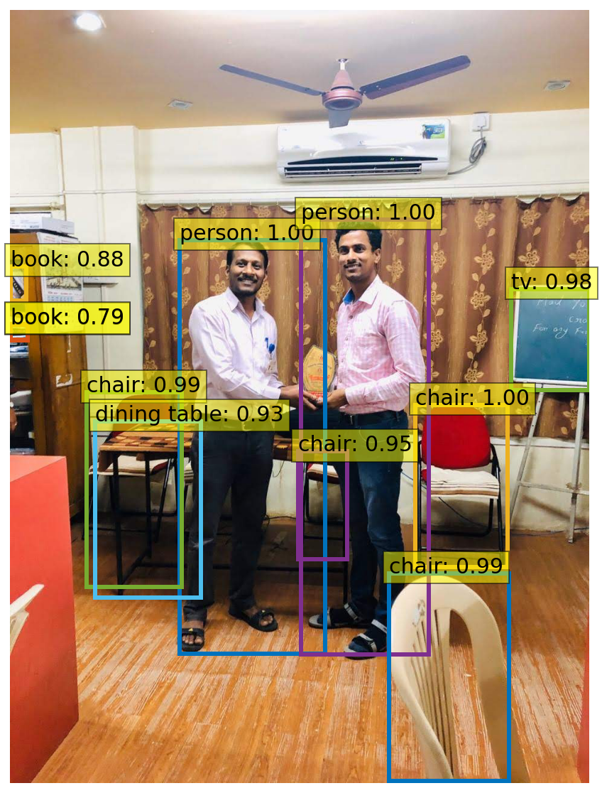

# Deep-Learning
Deep learning (also known as deep structured learning or hierarchical learning) is part of a broader family of machine learning methods based on artificial neural networks. Learning can be supervised, semi-supervised or unsupervised. **Deep learning architectures** such as `deep neural networks, deep belief networks, recurrent neural networks and convolutional neural networks` have been applied to fields including `computer vision, speech recognition, natural language processing, audio recognition, social network filtering, machine translation, bioinformatics, drug design, medical image analysis, material inspection and board game programs', where they have produced results comparable to and in some cases superior to human experts.

Artificial Neural Networks (ANNs) were inspired by information processing and distributed communication nodes in biological systems. ANNs have various differences from biological brains. Specifically, neural networks tend to be static and symbolic, while the biological brain of most living organisms is dynamic (plastic) and analog

**Input Images**

**Output Images:**

